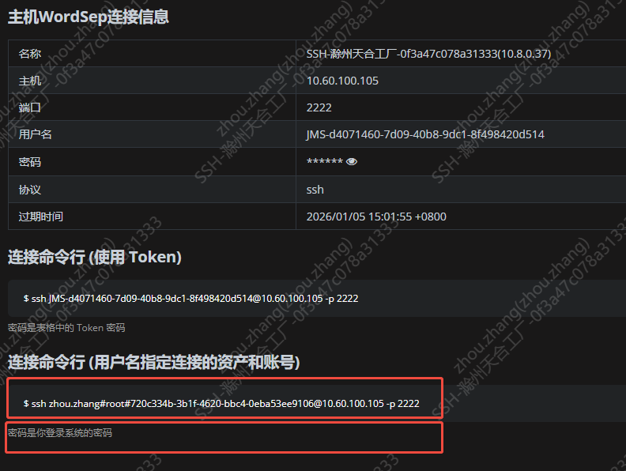

# 数据库查询工具 - 用户使用教程

本文档面向使用打包后的可执行文件的用户，介绍如何使用图形界面进行数据查询和导出。

> **注意**：本工具仅支持查询 `data_wide` 宽表，不再支持旧表（device_data、cmd_data）的查询。

## 目录

- [快速开始](#快速开始)
- [界面使用说明](#界面使用说明)
- [配置文件使用说明](#配置文件使用说明)
- [常见问题](#常见问题)

---

## 快速开始

### 1. 启动程序

1. 双击 `remote-tool.exe`（或对应平台的安装包）启动程序
2. 首次启动可能需要几秒钟，请耐心等待

### 2. 基本使用流程

```
连接SSH → 配置时间范围 → 执行查询/导出CSV → 查看结果
```

> **说明**：本工具直接从 `data_wide` 宽表查询数据，无需额外配置。

---

## 界面使用说明


### 一、SSH连接配置

#### 1.1 填写SSH连接信息

在 **"SSH连接配置"** 区域：


- **SSH连接指令**：输入SSH连接命令
  
  - 格式：`ssh 用户名@服务器地址 -p 端口号`
  - 示例：`ssh zhou.zhang#root#720c334b-3b1f-4620-bbc4-0eba53ee9106@10.60.100.105 -p 2222`

- **密码**：输入SSH登录密码（输入时会被隐藏显示）

#### 1.2 建立连接

1. 点击 **"连接"** 按钮
2. 等待连接状态显示为 **"已连接"**（绿色）
3. 如果连接失败，状态会显示 **"未连接"**（红色），请检查：
   - 服务器地址和端口是否正确
   - 用户名和密码是否正确
   - 网络是否畅通

#### 1.3 连接状态说明

- **未连接**（红色）：尚未连接或连接失败
- **已连接**（绿色）：连接成功，可以进行查询操作

---

### 二、数据库配置

在 **"数据库配置"** 区域：

- **数据库路径**：输入远程服务器上的数据库文件路径
  - 默认值：`/mnt/analysis/data/device_data.db`
  - 根据实际情况修改为正确的路径

---

### 三、查询配置

#### 3.1 数据库路径

- **数据库路径**：输入远程服务器上的数据库文件路径
  - 默认值：`/mnt/analysis/data/device_data.db`
  - 根据实际情况修改为正确的路径

> **说明**：程序会自动从 `data_wide` 表查询所有设备数据和命令数据，无需选择查询类型。

#### 3.2 设置时间范围

**开始时间**：

- 可以直接输入时间戳（如：`1704067200`）
- 或使用快捷按钮：
  - **今天**：设置为今天 00:00:00
  - **昨天**：设置为昨天 00:00:00
  - **最近7天**：设置为7天前的 00:00:00

**结束时间**：

- 可以直接输入时间戳
- 或使用快捷按钮：
  - **现在**：设置为当前时间

**时间格式说明**：

- 时间戳：`1704067200`（Unix时间戳，秒）
- 日期：`2024-01-01`
- 日期时间：`2024-01-01 12:00:00`

#### 3.3 执行查询或导出

**两种模式**：

1. **查询模式**：
   - 点击 **"执行查询"** 按钮
   - 查询结果会显示在下方的 **"查询结果"** 区域
   - 支持分页浏览（每页100条记录）
   - 结果按 `local_timestamp` 从早到晚排序

2. **导出模式**（推荐，支持大数据量）：
   - 点击 **"导出CSV"** 按钮
   - 在弹出的文件保存对话框中：
     - 选择保存位置
     - 输入文件名（默认：`wide_table_时间戳.csv`）
     - 点击 **"保存"**
   - 程序会使用流式处理导出数据，支持大数据量，不会占用大量内存
   - 导出过程中会显示实时日志和进度

---

### 四、查看查询结果

#### 4.1 结果预览

查询结果以表格形式显示在 **"查询结果"** 区域：

- 使用滚动条查看完整结果
- 支持横向和纵向滚动
- 结果按 `local_timestamp` 从早到晚排序
- 支持分页浏览（每页100条记录）

#### 4.2 结果说明

- **宽表数据**：显示所有设备的数据和命令数据
- **列名格式**：`{device_sn}_{field_name}`（例如：`METER001_activePower`）
- **时间字段**：`local_timestamp` 为毫秒级时间戳

---

### 五、导出数据

#### 5.1 导出为CSV

1. 点击 **"导出CSV"** 按钮（无需先执行查询）
2. 在弹出的文件保存对话框中：
   - 选择保存位置
   - 输入文件名（默认：`wide_table_时间戳.csv`）
   - 点击 **"保存"**

#### 5.2 CSV文件说明

导出的CSV文件特点：

- **编码格式**：UTF-8 with BOM（Excel可直接打开，不会乱码）
- **时间格式**：
  - `local_timestamp`：格式化为 `YYYY-MM-DD HH:MM:SS.mmm`（东八区，包含毫秒）
- **列顺序**：`local_timestamp` 列在最前，其他列按字母顺序排列
- **数据完整性**：包含 `data_wide` 表中的所有列

#### 5.3 在Excel中打开

1. 双击CSV文件，用Excel打开
2. 如果出现乱码，在Excel中选择 **"数据" → "从文本/CSV导入"**，选择UTF-8编码
3. 建议使用Excel 2016或更高版本

---

### 六、保存配置

#### 6.1 保存当前配置

点击 **"保存配置"** 按钮，可以保存：

- SSH连接信息
  
  - 保存ssh地址和密码（用户名指定连接的资产和账号）后，后续登录可以直接使用，重复登录

- 数据库路径

- 查询配置
  
  #### 6.2 自动加载配置

下次启动程序时，会自动加载上次保存的配置。

---

### 七、部署/更新采集程序


#### 7.1 部署配置

* 是否部署或者更新配置文件

* 是否部署或者更新拓扑文件
  
  > 当前拓扑文件是必须的，虽然现在宽表通过sn+字段名的方式确保了列名的唯一性，但是生成的时候需要从配置文件中获取需要从扩展表中提取的字段，而配置字段通过设备类型比较合理

* 部署后是否启动服务，启动的话会执行 
  
  ```bash
  systemctl start ancol
  ```

* 部署日志：输出部署过程操作

* 文件路径：通过弹窗选择需要部署的可执行文件，每次修改会自动保存

---

## 数据表说明

### data_wide 宽表

本工具直接从 `data_wide` 表查询数据，该表包含：

- **主键**：`local_timestamp`（毫秒级时间戳）
- **动态列**：根据实际数据动态创建
- **列名格式**：`{device_sn}_{field_name}`
  - 设备数据列：例如 `METER001_activePower`、`STORAGE001_soc`
  - 命令数据列：例如 `METER001_activePowerLimit`、`STORAGE001_chargeLimit`

**特点**：
- 所有设备的数据和命令数据在同一张表中
- 同一时间点的数据在同一行，便于分析
- 列根据配置和实际数据动态创建

> **注意**：本工具不再支持旧表（device_data、cmd_data、device_data_ext）的查询。

---

## 常见问题

### Q1: 程序无法启动

**可能原因**：

- 杀毒软件阻止运行
- 系统依赖缺失

**解决方法**：

1. 将程序目录添加到杀毒软件白名单
2. 检查系统依赖是否完整

---

### Q2: SSH连接失败

**可能原因**：

- 服务器地址、端口、用户名或密码错误
- 网络不通
- 防火墙阻止

**解决方法**：

1. 检查SSH连接信息是否正确
2. 使用命令行测试SSH连接：`ssh user@host -p port`
3. 检查防火墙设置

---

### Q3: 查询失败

**可能原因**：

- 数据库路径不正确
- 数据库文件不存在
- 时间范围设置错误

**解决方法**：

1. 检查数据库路径是否正确
2. 确认数据库文件存在
3. 检查时间格式是否正确（时间戳或日期格式）

---

### Q4: CSV导出后字段不全

**可能原因**：

- `data_wide` 表中确实没有该字段
- 该时间范围内没有该设备的数据

**解决方法**：

1. 检查 `data_wide` 表结构，确认字段是否存在
2. 扩大时间范围，确认是否有该设备的数据
3. 列名格式为 `{device_sn}_{field_name}`，确认设备序列号是否正确

---

### Q5: CSV文件在Excel中乱码

**解决方法**：

1. 使用Excel 2016或更高版本
2. 如果仍乱码，使用Excel的 **"数据" → "从文本/CSV导入"** 功能
3. 在导入时选择UTF-8编码

---

### Q6: 查询或导出失败

**可能原因**：

- 数据库路径不正确
- `data_wide` 表不存在
- 时间范围设置错误

**解决方法**：

1. 检查数据库路径是否正确
2. 确认 `data_wide` 表存在
3. 检查时间格式是否正确（时间戳或日期格式）

---

### Q7: 时间戳格式说明

**说明**：

- `local_timestamp`：在CSV中格式化为 `YYYY-MM-DD HH:MM:SS.mmm`（东八区，包含毫秒）
- 程序会自动格式化时间戳，这是正常现象

---

### Q8: 如何查看所有可用字段

**方法**：

1. 执行查询，查看结果表格中的所有列
2. 列名格式为 `{device_sn}_{field_name}`，例如：
   - `METER001_activePower` - 电表METER001的有功功率
   - `STORAGE001_soc` - 储能设备STORAGE001的SOC
   - `METER001_activePowerLimit` - 电表METER001的有功功率限制命令

---

## 技术支持

如遇到其他问题，请：

1. 检查数据库路径和表结构是否正确
2. 查看程序运行时的错误提示和日志
3. 联系技术支持并提供：
   - 错误信息截图
   - 操作步骤
   - 数据库路径和表结构信息

---

## 附录

### 时间格式参考

| 输入格式 | 示例                    | 说明              |
| ---- | --------------------- | --------------- |
| 时间戳  | `1704067200`          | Unix时间戳（秒）      |
| 日期   | `2024-01-01`          | 自动转换为当天00:00:00 |
| 日期时间 | `2024-01-01 12:00:00` | 完整日期时间          |
| 关键字  | `today`               | 今天00:00:00      |
| 关键字  | `yesterday`           | 昨天00:00:00      |
| 关键字  | `7days`               | 7天前00:00:00     |
| 关键字  | `now`                 | 当前时间            |

### 设备类型说明

- **METER**：电表设备
- **STORAGE**：储能设备
- **PV**：光伏设备
- **CHARGER**：充电桩设备

### CSV文件列说明

**固定字段**：

- `local_timestamp`：本地时间戳（格式化后，包含毫秒），始终在第一列

**动态字段**（根据 data_wide 表结构）：

- 列名格式：`{device_sn}_{field_name}`
- 设备数据列：例如 `METER001_activePower`、`STORAGE001_soc`
- 命令数据列：例如 `METER001_activePowerLimit`、`STORAGE001_chargeLimit`
- 列顺序：除 `local_timestamp` 外，其他列按字母顺序排列

---

**文档版本**：2.0  
**最后更新**：2025.1.8  
**更新说明**：仅支持 data_wide 宽表查询，不再支持旧表查询和配置文件
